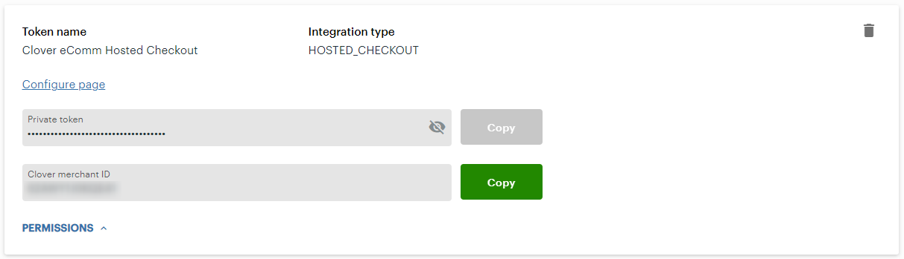

There are a few simple steps required to set up the app for your development environment.

1. In the root of your checkout, create an .env file.
1. Log in to your sandbox test merchant account.
1. On the side-nav, select **Setup > API Tokens**.
  
1. In your .env file, add the following keys:

    ```bash
    API_KEY=
    MERCHANT_ID=
    ```

1. On the API Tokens page, click the eye icon to reveal your token. Click **Copy** and paste the value in the .env file:

    ```bash
    API_KEY={Private token}
    ```

1. On the API Tokens page, click **Copy** and paste the merchant ID value in the .env file:

    ```bash
    API_KEY={Private token}
    MERCHANT_ID={Clover merchant ID}
    ```
    
1. Save and close the .env file.
1. Install the app's dependencies by running `yarn install`.

Next, you can start the walkthrough in [Adding the checkout component](../../walkthrough/adding-the-checkout-component/).
