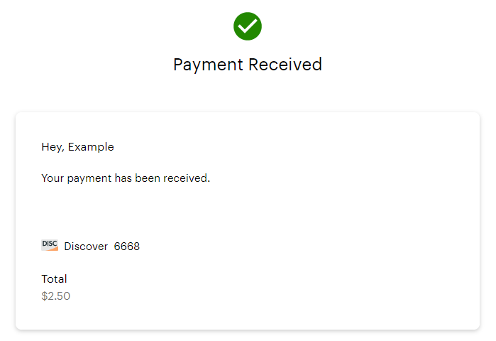

Once the app is configured, built, and running, follow these steps to walk
through the checkout experience.

1. Open [http://localhost:3000](http://localhost:3000).
1. Click **Pay**. _The hosted checkout page appears_.
1. In the First name and Last name fields, enter a name.
1. In the Email field, enter a valid email address to receive the transaction receipt.
1. In the Card Number field, enter `6011361000006668`.
1. In the Expiration field, enter any month and year in the future.
1. In the CVV field, enter any three-digit number.
1. In the Zip field, enter any five-digit number.
1. Click **Pay**.
  _The payment is processed and you are redirected to the success page._

### What's next

Now that you have successfully processed a test payment, you can explore other features of hosted checkout. See [Customize your checkout page](https://www.clover.com/help/customize-checkout-page/) for more information about the ways you can style and enrich the customer experience.